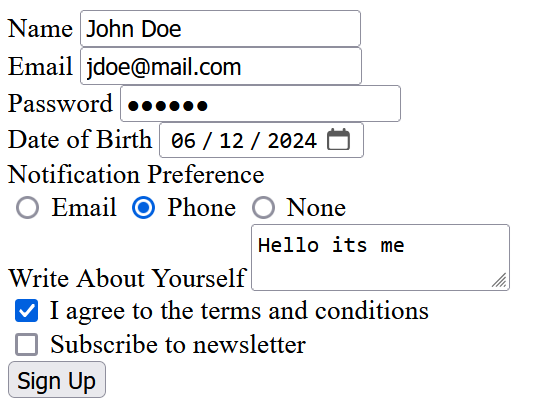

# Day 1 - Session 1 - Intro to HTML

Video: <https://www.youtube.com/watch?v=v5ZcDwQriEM>

## Screenshot

## How to Run

Open `index.html` in the browser.

# Day 1 - Session 2 - HTML Forms

Video: <https://www.youtube.com/watch?v=EXRL7U4RMjE>

## Screenshot

## How to Run

Open `signup.html` in the browser.

# Day 2 - Session 1 - Intro to CSS

Video: <https://www.youtube.com/watch?v=_PJqfx-0xTY>

# Day 2 - Session 2 - Styling Form with CSS

Video: <https://www.youtube.com/watch?v=hNwpzWtQ6os>

